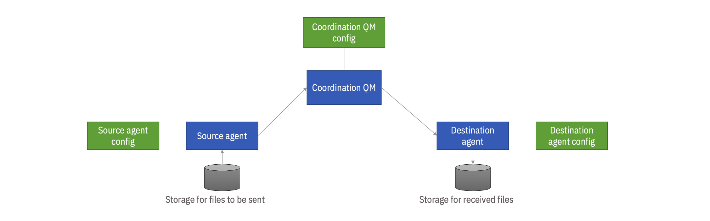

# Running IBM MQ Managed File Transfer on Red Hat OpenShift cluster


This repository contains an example of the artifacts needed to configure, not only the coordination queue manager but also sender and receiver agents of the MQ Managed File Transfer in the Red Hat OpenShift environment. 

The configuration of the queue manager is based on the IBM MQ operator available as part of the installation of the **IBM Cloud Pak for Integration**, and the configuration of agents is based on the container image available in the DockerHub registry: https://hub.docker.com/r/ibmcom/mqmft


More technical details about described technologies can be found using these sources:
1. [IBM Cloud Pak for Integration](https://www.ibm.com/docs/en/cloud-paks/cp-integration)
2. [Deploying messaging services](https://www.ibm.com/docs/en/cloud-paks/cp-integration/2021.4?topic=deploying-messaging-services)
2. [Managed File Transfer overview](https://www.ibm.com/docs/en/ibm-mq/9.2?topic=overview-managed-file-transfer)
3. [Configuring Managed File Transfer](https://www.ibm.com/docs/en/ibm-mq/9.2?topic=configuring-managed-file-transfer)
4. [IBM MQ Managed File Transfer Container](https://github.com/ibm-messaging/mq-container-mft)

The following picture shows a high-level overview of the example configuration:




## Configuration steps:

>Note: This example assumes that all objects are created in the OpenShift project called **mq** and therefore all YAMLs contain line *namespace: mq* 
Please correct this specification as well as the names of the objects in order to fit your environment.

>All YAML files needed for creating objects are available here in this repository in the directory [artifacts](artifacts).

### 1. Create entitlement key secret

In the case of the "online" installation, a secret that contains the IBM entitlement key must exist in the namespace. This key is needed for pulling the container images from the IBM registry. It is not necessary in the case of the "air-gapped" installation since the images are already mirrored in the local registry. 

You can obtain the entitlement key here: https://myibm.ibm.com/products-services/containerlibrary

Optionally, store it to the variable:
```
export ENTITLEMENT_KEY=..your previously obtained key...
```

Verify if you can connect to the IBM registry:
```
podman login cp.icr.io --username cp --password $ENTITLEMENT_KEY
```

Create the secret in your project (in this case *mq*):
```
oc create secret docker-registry ibm-entitlement-key --docker-username=cp --docker-password=$ENTITLEMENT_KEY --docker-server=cp.icr.io --namespace=mq
```

### 2. Prepare the queue manager configuration

The *QueueManager* custom resource definition provided by the MQ operator allows scripts with MQSC commands to be stored in Kubernetes Config Maps and assigned to the queue manager. Those scripts are executed every time when a new instance of the queue manager pod is created and therefore are a convenient way of preparing the queue manager configurations (please see [Supplying MQSC and INI files](https://www.ibm.com/docs/en/ibm-mq/9.2?topic=manager-example-supplying-mqsc-ini-files) chapter from the MQ documentation for more details). 


In the case of on-premises installation, we use commands like *fteSetupCoordination* or *fteCreateAgent* to generate MQSC scripts and then execute those scripts in order to prepare the MFT configuration. In our example here, we will put such scripts to the Config Map. 

The example of the Config Map object is available here: [CoordinationQM-conf.yaml](artifacts/CoordinationQM-conf.yaml)


Besides the MFT-related ones, it contains also commands that create a channel and disable security. The security is disabled to simplify the example. Please correct this if you are preparing the production configuration.

Create the Config Map (in this case in *mq* namespace):
```
oc apply -f CoordinationQM-conf.yaml
```

### 3. Prepare agents configuration

Agents' configuration is defined in JSON format. In our case, we will store it again in the Kubernetes Config Map object. In this example, we are running the agents in the same OpenShift cluster as the queue manager and therefore we can use an internal queue manager URL:

```json
  ...
  "qmgrName":"MQMFT",
  "qmgrHost":"mft-ibm-mq.mq.svc.cluster.local",
  "qmgrPort":1414,
  "qmgrChannel":"DEV.APP.SVRCONN",
  ...
```

Please change the host, port, queue manager name, and channel to fit your environment.

The example of the agent configuration is available here: [Agent-conf.yaml](artifacts/Agent-conf.yaml)

You can create it with:

```
oc apply -f Agent-conf.yaml
```

### 4. Create storage for sending and receiving files

We will create simple Persistent Volume Claims. Those PVCs will be later mounted as volumes in the agents' pods.

Source agent PVC: [PVC-src.yaml](artifacts/PVC-src.yaml)

Destination agent PVC: [PVC-dest.yaml](artifacts/PVC-dest.yaml)

Create them:
```
oc apply -f PVC-src.yaml
oc apply -f PVC-dest.yaml
```

### 5. Create queue manager

The queue manager definition is available here: [CoordinationQM.yaml](artifacts/CoordinationQM.yaml)

Please change the **spec/license/accept** setting to **true** before running (for the legal reasons, you must explicitly accept it)
```yaml
...
spec:
  license:
    accept: false
    license: L-RJON-C7QG3S
    use: NonProduction
...
```

Please note how the MQSC scripts from the Config Map are assigned to the queue manager:
```yaml
  ...
  queueManager:
    name: MQMFT
    mqsc:
      - configMap:
          name: mft-conf
          items:
            - qmgr-security.mqsc
            - demo-objects.mqsc
            - coordination-qm-setup.mqsc
            - source-agent.mqsc
            - dest-agent.mqsc
  ...
```
If necesary, correct the version of the product.

Run:
```
oc apply -f CoordinationQM.yaml
```

### 6. Create agents

Agents are defined as Kubernetes Deployments that use **docker.io/ibmcom/mqmft:latest** image.

Source: [Agent-src.yaml](artifacts/Agent-src.yaml)

Destination: [Agent-dest.yaml](artifacts/Agent-dest.yaml)

Please review volume mounts and the environment variables. 

Create them:
```
oc apply -f Agent-src.yaml
oc apply -f Agent-dest.yaml
```

### 7. Test if it works


Wait until all pods are up and running.

Navigate to the **source agent** pod terminal (for example use the OpenShift web console for that) and type the command to list the agents:
```
fteListAgents
```

Obtain the details of the individual agent
```
fteShowAgentDetails <agent name>
```

Go to the directory **mountpath** (the previously created volume is mounted to the directory)
```
cd /mountpath
``` 
Create a simple file, for example:
```
vi text.txt
...
```

Transfer this file:
```
fteCreateTransfer -rt -1 -sa SRCAGENT -sm MQMFT -da DESTAGENT -de overwrite -dm MQMFT -df "/mountpath/test.txt" "/mountpath/test.txt"
```

List the transfers to see if our transfer was successful:
```
mqfts
```

Navigate to the termial of the **destination agent** pod. Go to the same, **mountpath** directory and check if our file is there:
```
cd /mountpath
ls -l
```


